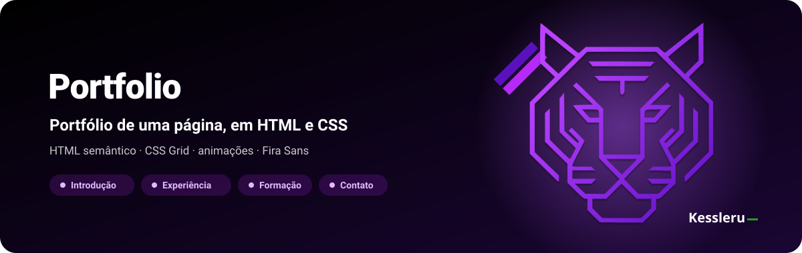
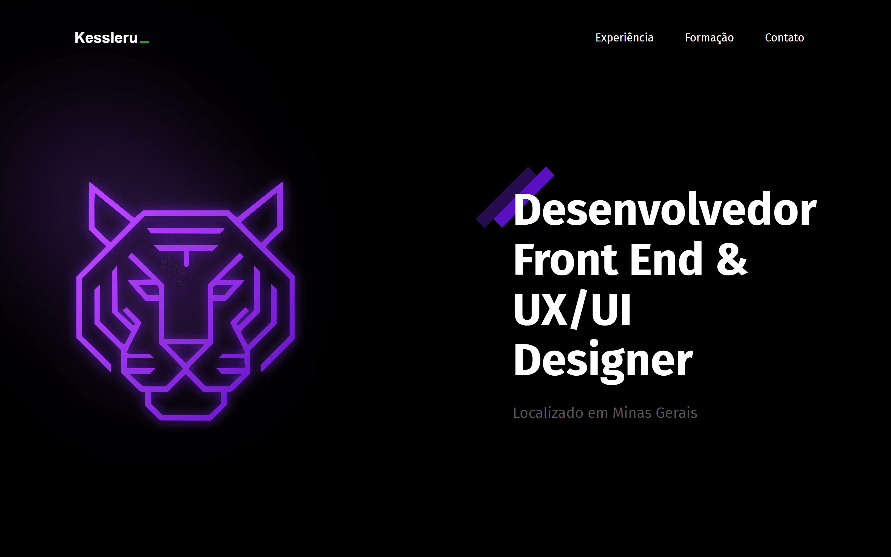
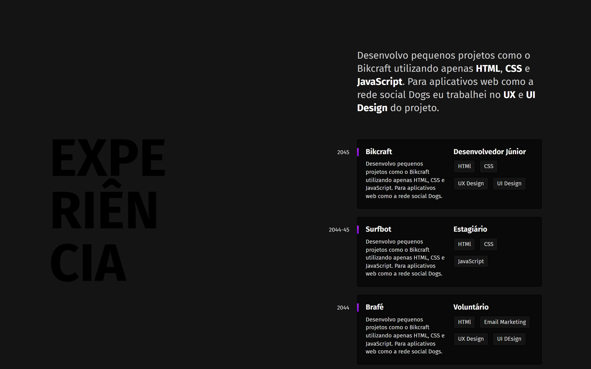
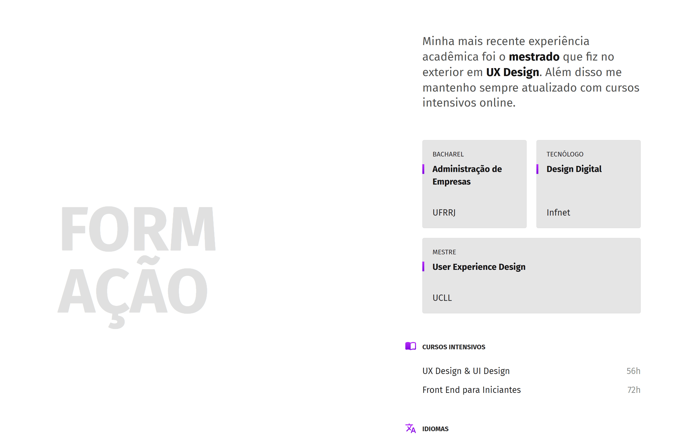
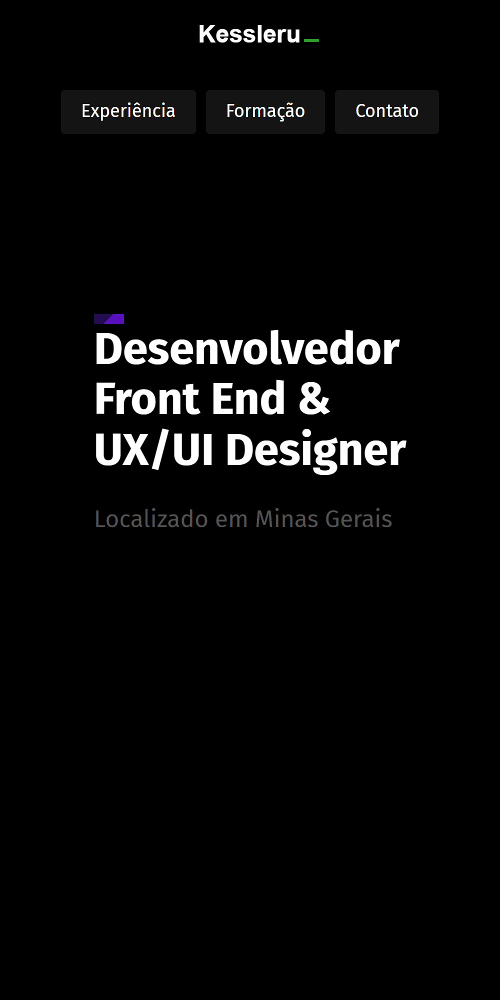
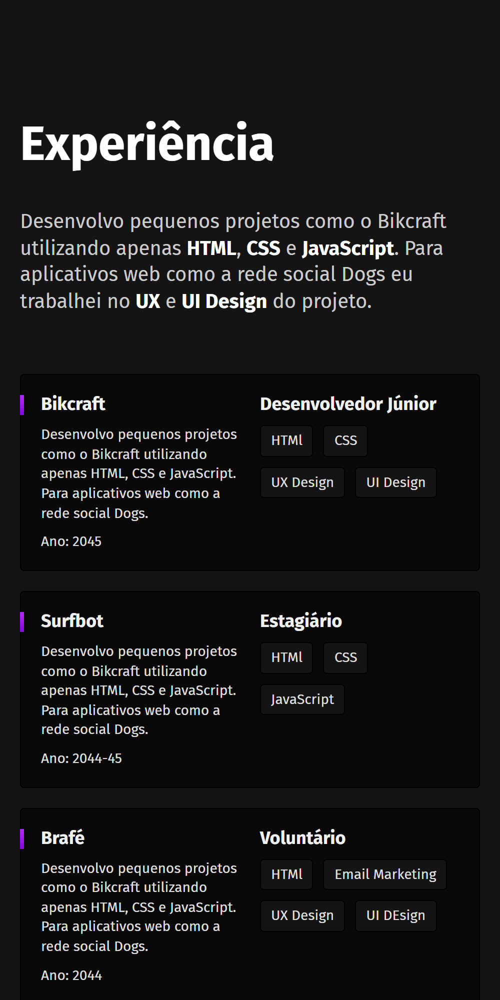

<div align="center">



**Portfólio de uma página em HTML e CSS: introdução, experiência, formação e contato, com o CSS dividido por seção.**

[](https://kessleru.github.io/Portfolio/)
[](https://github.com/kessleru/Portfolio/actions/workflows/pages/pages-build-deployment)
[](https://github.com/kessleru/Portfolio/commits/main)



</div>

## Sobre

Um portfólio de página única, escuro, com um tigre desenhado em SVG no topo e três seções abaixo.
É um estudo de layout: cada seção usa o mesmo `.container` em grid de duas colunas (`1fr 2fr`), com
o título gigante de um lado e o conteúdo do outro, e cada uma tem o próprio arquivo CSS.

Os textos de experiência e formação são **conteúdo de exemplo** — o foco do projeto é a estrutura e
o visual, não o currículo.

## Telas

### Experiência

Cards com empresa, descrição, cargo e tags de tecnologia, e o ano alinhado fora do card.



### Formação

Fundo claro para quebrar o ritmo, cards de curso e listas de cursos intensivos e idiomas com ícones.



### Celular

Abaixo de 1200px o tigre sai e o título ocupa a introdução; abaixo de 800px todas as seções viram
coluna única.

<table>
<tr>
<td width="50%"></td>
<td width="50%"></td>
</tr>
<tr>
<td align="center"><sub><b>Introdução</b></sub></td>
<td align="center"><sub><b>Experiência</b></sub></td>
</tr>
</table>

## Funcionalidades

| | |
|---|---|
| 🐯 **Tigre em SVG** | Logo em linhas roxas com um brilho difuso (`filter: blur`) que atravessa a imagem em loop |
| ✨ **Animações** | Título entra com *fade* de baixo para cima; o cursor verde do logo pisca com `@keyframes blink` |
| 📐 **Grid por seção** | Todas as seções compartilham o `.container` de duas colunas |
| 📱 **Responsivo** | Breakpoints em 1500px, 1200px, 800px e 400px |
| 🧭 **Navegação por âncora** | O menu leva a `#experiencia`, `#formacao` e `#contato` |

## Stack

| Camada | Ferramenta |
|---|---|
| Marcação | HTML5 semântico, com `aria-label` nas seções |
| Estilo | CSS3 — Grid, Flexbox, `@keyframes`, `@import` por seção |
| Fonte | [Fira Sans](https://fonts.google.com/specimen/Fira+Sans) (Google Fonts) |
| Deploy | [GitHub Pages](https://pages.github.com) |

## Rodando localmente

```bash
git clone https://github.com/kessleru/Portfolio.git
cd Portfolio
python -m http.server 8000
```

Abra `http://localhost:8000`. Não há dependências nem build.

## Estrutura

```
├── index.html
├── css/
│   ├── style.css        # só importa os arquivos abaixo, na ordem da página
│   ├── global.css       # reset, .container em grid, .subtitulo e fade-in
│   ├── header.css
│   ├── introducao.css   # tigre, brilho animado e título
│   ├── experiencia.css
│   ├── formacao.css
│   └── footer.css
└── img/                 # tigre, marca, detalhes diagonais e ícones (SVG)
```

<details>
<summary><b>Regerando as imagens deste README</b></summary>

```bash
node .github/readme/gerar.mjs                 # banner.svg

python -m http.server 8000                    # em outro terminal
npm i --no-save puppeteer-core sharp
node .github/readme/capturar.mjs              # telas em 2x
```

</details>

---

<div align="center">
<sub>Feito por <a href="https://github.com/kessleru">Otávio Kessler Ustra</a></sub>
</div>
